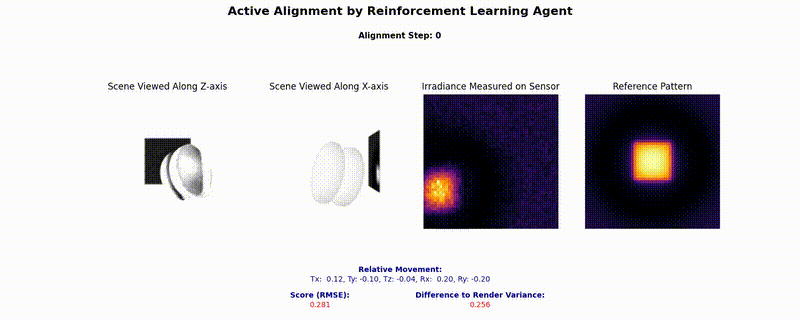

# Relign

Relign is a Python software for simulating the active alignment of optical
systems. More precisely, Relign can be used to analyze the sensor output of
multi-lens systems by changing the relative alignment to the sensor. It also
offers an interface for reinforcement learning algorithms to well-known open
source libraries such as Gymnasium and Stable-Baselines.

An example of a trained RL agent, aligning a lens system with two lenses
within 10 steps can be seen here:





The methodology and results are detailed in our paper, that is currently under review and 
available as a preprint on [arXiv:2503.02075](https://arxiv.org/abs/2503.02075).


## Getting Started

### Prerequisites

Ensure you have the following installed:
- Python 3.10+
- [pip](https://pip.pypa.io/en/stable/installation/)

### Installation

Once cloned, install the package with:

```bash
pip install .
pip install .[dev]
```

### Run the tests

```bash
pytest
```

### Build the docs

Run
```bash
mkdocs serve
```

to build and serve the docs locally.


### Environment

To familiarize yourself with using the environment for your own algorithms, see [this 
jupyter notebook](docs/getting_started.ipynb).

### Training a Model

To start training a model, use the `scripts/train.py` script. You can customize the training parameters using command-line options.

#### Example Command

```bash
python3 train.py --env="la" --curriculum --model=PPO \
    --learning-rate=LEARNING_RATE --ent-coef=0.01 \
    --benchmark="b_L2_N000"
```

## Citation

```
@misc{burkhardt2025relign,
      title={Active Alignments of Lens Systems with Reinforcement Learning}, 
      author={Matthias Burkhardt and Tobias Schmähling and Michael Layh and Tobias Windisch},
      year={2025},
      eprint={2503.02075},
      archivePrefix={arXiv},
      primaryClass={cs.RO},
      url={https://arxiv.org/abs/2503.02075}, 
}
```

## Funding


This work was funded by the German Federal Ministry of Education and Research (BMBF) under 
grant number 13FH605KX2.
